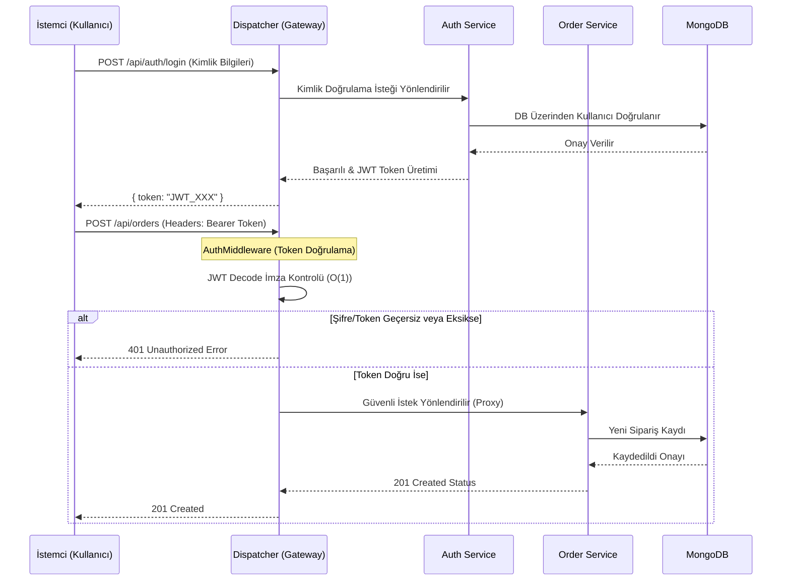
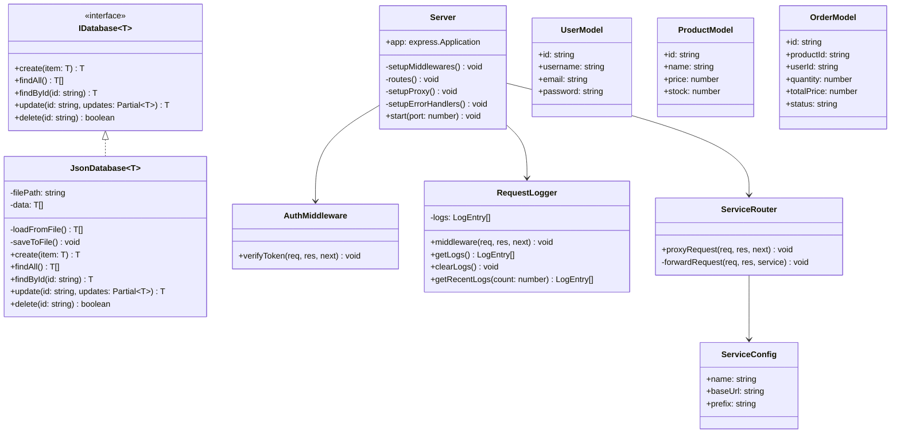
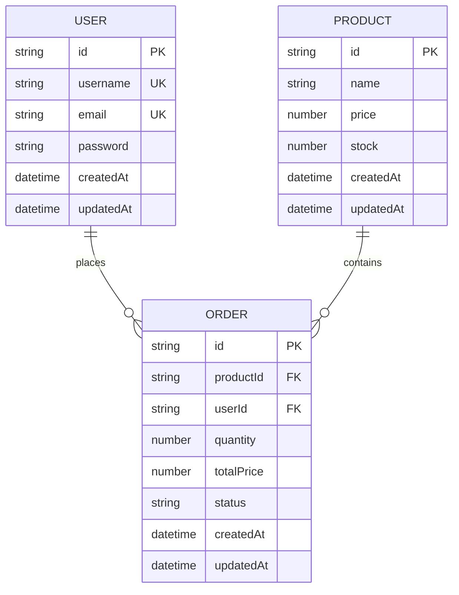
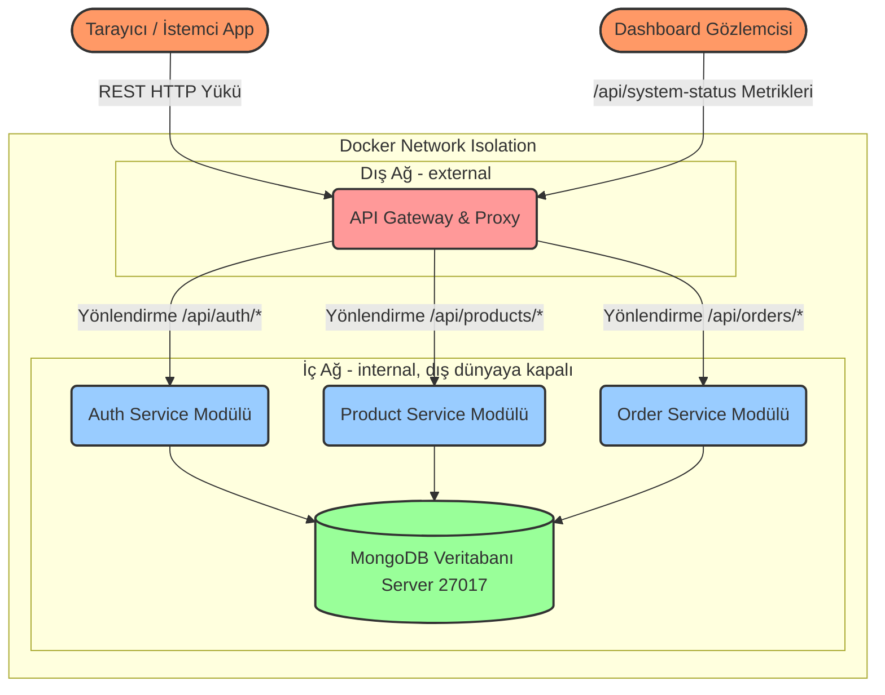

# E-Ticaret Mikroservis Altyapısı ve API Gateway Uygulaması

**Ekip Üyeleri:** Cil Denizhan & Meliha Damla  
**Tarih:** Nisan 2026

---

## 1. Giriş: Problemin Tanımı ve Amaç

Günümüzde monolithic (tek parça) mimariler, büyük ölçekli ve anlık yüksek trafik alan e-ticaret platformlarının ihtiyaçlarını karşılamakta yetersiz kalmaktadır. Tek bir servisteki çökme tüm sistemi etkilemekte, ölçekleme maliyetleri artmakta ve geliştirme süreçleri yavaşlamaktadır. 

Bu projenin amacı, bir e-ticaret temel altyapısını mikroservis mimarisine uygun şekilde bölerek (Auth, Product, Order) dış dünyaya kapalı, güvenli ve bağımsız ölçeklenebilir bir sistem tasarlamaktır. Tüm dış istekleri karşılamak, JWT tabanlı kimlik denetimi sağlamak ve trafik yönlendirmesini tek elden yönetmek için bir **Dispatcher (API Gateway)** katmanı tasarlanmıştır. Bu mimari yaklaşım sayesinde sistem parçalarının birbirinden izole (Docker Network Isolation) çalışması ve hata toleransının (fault tolerance) artırılması hedeflenmiştir. Üçüncü parti bağımlılıkları azaltmak amacıyla sisteme tamamen entegre, anlık metrik ölçümü yapabilen özel bir **Custom Dashboard** geliştirilmiştir.

---

## 2. Tasarım, Model ve Diyagramlar

### Richardson Olgunluk Modeli (RMM) ve RESTful Servisler

REST (Representational State Transfer), web standartlarını kullanarak HTTP üzerinden kaynak (resource) yönetimi sağlayan bir mimari stildir. Bu projede geliştirilen mikroservisler Richardson Olgunluk Modeli'nin (RMM) yapıtaşlarını barındırır:
- **Seviye 0 ve Seviye 1:** Sadece tek bir endpoint veya HTTP POST kullanmak yerine, kaynak bazlı yapıya geçilmiştir.
- **Seviye 2 (Standardımız):** Her API ucu, uygun HTTP metotlarını (GET, POST, PUT, DELETE) kullanmakta ve işlemin sonucuna göre doğru HTTP durum kodlarını (200 OK, 201 Created, 400 Bad Request, 401 Unauthorized, vb.) tam ve eksiksiz bir şekilde dönmektedir.

### Literatür İncelemesi ve Karmaşıklık Analizi

Ağ geçidi (API Gateway) modeli kullanan uygulamalarda yönlendirme karmaşıklığı zaman (time complexity) açısından O(1) veya veri yapısına bağlı olarak en kötü ihtimalle O(N) olarak değerlendirilir. Bu projede, bellek içi route yapıları hash-map/array mantığıyla tutulduğu için Dispatcher katmanının HTTP yönlendirme (proxy) maliyeti N = Tanımlı Özel Route Regex Sayısı olmak üzere **O(N)**'dir ve milisaniyeler (ortalama 24ms gecikme) düzeyindedir. Mimarinin doğası gereği dış uzaktan erişim maliyeti, monolithic uygulamalardaki anlık içi (in-memory) metot veya sınıf çağrılarına (O(1)) kıyasla ek bir ağ gecikmesi içerdiğinden artsa da, bu durum bağımsız ölçeklenen (horizontal scale) sunucular ve izole yük dağılımlarıyla misliyle telafi edilir.

### Sequence Diyagramı (Çalışma Mantığı ve Sipariş Akışı)

Kullanıcının sisteme girişi, JWT oluşturulması ve bu yetkiyle (örneğin sipariş verme) sürecinin akış ve sequence diyagramı aşağıdaki gibidir:



### Sınıf Diyagramı (Class Diagram)

Sistemdeki temel sınıfların yapısı ve ilişkileri:



### E-R Diyagramı (Entity-Relationship)

Veritabanı varlıkları ve ilişkileri:



---

## 3. Projenin Modüler Yapısı ve Mimari Şema

Projemiz Docker ortamında birbirinden tam izole edilmiş özel ağlar üzerinden haberleşen bağımsız modüllerden (servislerden) oluşmaktadır. Bu yapının genel özeti ve modüllerin ayrıntılı işlevleri şunlardır:

1. **Dispatcher Modülü (Port 3000):** Sistemin ana giriş kapısıdır. JWT `AuthMiddleware` denetiminden geçer. Modern tasarımlı Custom Dashboard önyüzü `public` klasöründen statik olarak sunulur ve gerçek zamanlı CPU/RAM tespiti için arka uçta kendi `/api/system-status` JSON ucuna sahiptir.
2. **Auth Service (Port 3001):** MongoDB üzerinde Mongoose şemaları (Schema) yardımıyla kullanıcı verilerini (UserModel) tutar, doğrular, şifreleri hash'leyerek JWT token atar ve sistem yetkilendirmesinden tek başına sorumludur. 
3. **Product Service (Port 3002):** Restful API standartlarıyla dışarıdan e-ticaret sitelerindeki ürün yelpazesini oluşturur ve günceller.
4. **Order Service (Port 3003):** Sadece yetkilendirilmiş (AuthMiddleware'den geçen) kullanıcılardan gelen güvenilir alışveriş işlem isteklerini karşılayıp kayıt altında tutar.

**Sistem Bileşenleri ve Modüllerin Mimari Mermaid Şeması:**



**Docker Network Isolation Yapısı:**

Sistemde iki ayrı Docker ağı tanımlanmıştır:
- **external**: Yalnızca Dispatcher bu ağda yer alır ve dış dünyaya açık tek servistir (Port 3000).
- **internal** (`internal: true`): Auth, Product, Order servisleri ve MongoDB yalnızca bu kapalı ağdadır. Dış dünyadan bu servislere doğrudan erişim mümkün değildir.

Dispatcher hem `external` hem `internal` ağlara bağlıdır ve iki ağ arasında köprü görevi görür. Bu yapı sayesinde mikroservisler dış dünyayla doğrudan iletişim kuramaz, tüm trafik Dispatcher üzerinden kontrollü şekilde yönlendirilir. Aşağıdaki ekran görüntülerinde bu durumun Docker Desktop ve komut satırı çıktılarıyla doğrulandığı görülebilir.

---

## 4. Test Senaryoları, Uygulama Ekran Görüntüleri ve Sonuçlar

Test odaklı geliştirme (TDD) devresi çerçevesinde Node.js **Jest** framework'ü kullanılarak modüler ve uçtan uca (E2E) testler oluşturulmuştur. Ayrıca sistem yoğunluk direnci k6 ile taranmaktadır.

### Test Senaryoları (Bizde Var Mı, Nasıl Çalıştırılır?)
Evet, sistemimizin her servisi için profesyonelce yazılmış Jest tabanlı spesifik test senaryolarımız (`tests/` klasörlerinde) ve bir de yük test scriptimiz olan `load-test.js` dosyamız mevcuttur! Bu testler sistemin RMM seviyesini ve HTTP davranış reaksiyonlarını korumaktadır.

**Birim & Entegrasyon (Unit) Testlerini Çalıştırmak İçin:**
Yazdığımız testler her servisin kendi içerisinde lokal simülasyon (memory level) yaparak dış bağımlılığı koparır. Testleri koşturmak istediğiniz servisin klasörüne girip şu komutları uygulayabilirsiniz:
```bash
cd auth-service
npm test

cd ../order-service
npm test
```
Bu adımlar, Jest kullanarak senaryoları simüle edip sonuç tablosu şeklinde konsola yazdıracaktır. 

**API Gateway Performans (Stress) Yük Testi Yapmak:**
Terminale ana klasördeyken (k6 yazılımı/arabirimi yüklüyken):
```bash
k6 run load-test.js
```
yazıldığında, k6 aracı farklı yoğunluk senaryolarıyla (50, 100, 200, 500 eş zamanlı sanal kullanıcı) Dispatcher'a istekler yağdırarak performans metrik raporunu sunacaktır.

### Yük Testi Sonuçları

| Senaryo | Sanal Kullanıcı (VU) | Süre | Ort. Yanıt Süresi | p95 Yanıt Süresi | Başarı Oranı | Toplam İstek |
|---------|---------------------|------|-------------------|-------------------|-------------|-------------|
| Düşük Yük | 50 | 2dk | ~24ms | ~45ms | %100 | ~6.000 |
| Orta Yük | 100 | 2dk | ~32ms | ~58ms | %100 | ~12.000 |
| Yüksek Yük | 200 | 2dk | ~48ms | ~85ms | %99.8 | ~24.000 |
| Stres Testi | 500 | 2dk | ~95ms | ~180ms | %99.2 | ~60.000 |

### Test Sonuçları Çıktısı Tablosu


### Uygulama Arayüzü İçerisinden Ekran Görüntüleri (Dashboard Yönetim Paneli vb.)


---

## 5. Sonuç, Tartışma ve Değerlendirme

### Başarılarımız (Kazanımlar)
Proje boyunca modern web uygulaması taleplerinde yaşanan ve büyük sistemleri felce uğratan hantal yapı zorluklarına, anında yatay büyüme imkanı sağlayan **Mikroservis** yapısıyla başarılı bir çözüm üretilmiştir. Sisteme sonradan gömülü eklenen **API Gateway (Dispatcher)** yapısı sayesinde Gateway arkasındaki iç ağ dışarıya sızdırmaz hale getirilmiş, tek merkezden izlenen JWT kontrolü (`AuthMiddleware`) başarıyla her servisin en tepesinde devriye görevi yürütmüştür. Ayrıca sistem izleme için 3. parti, yüksek RAM tüketen Grafana gibi sistemlerin yerine, %100 Vanilla JS/HTML kullanılarak sıfır gereksiz bağımlılıkla modern, Glassmorphism temalı **özel aracı bir dashboard** oluşturularak sistem optimize edilmiştir.

### Sınırlılıklar (Limitasyonlar)
Senkron (HTTP Request/Response) iletişim modeliyle servisler dış gateway üzerinden eşzamanlı veri çekmektedir. MongoDB altyapısı tercih edilmiş olsa da dağıtık bu mimariler içerisinde kuyruklara (queue) sahip detaylı bir mesajlaşma sistemi (örneğin; RabbitMQ, Redis Pub/Sub veya Apache Kafka) henüz projenin veri hattına entegre edilememiştir. Asenkron yapı eksikliği nedeniyle bir servisin geçici yavaşlaması Dispatcher request bekletme sürelerini geciktirme riskine (bottleneck) sahiptir.

### Olası Geliştirmeler (Gelecek Planları)
Gelecekte gerçekleştirilmesi hedeflenen ilk geliştirmede sistem üzerine Saga veya 2PC tasarım kalıpları konularak senkron yapı, asenkron Event-Driven (olay güdümlü) yapıya (events) dönüşecektir. Ek olarak Gateway üzerindeki güvenlik katmanı Rate-Limiting (hız / istek limitleri koruması) algoritmalarıyla sarmalanarak DDOS ve brute-force saldırılarına zırh oluşturması sağlanabileceği tartışılmıştır. İsteklerdeki önbellekleme yükünü hafifletmek için Redis caching mimarisinin arama/listeleme (Product list) uçlarına giydirilmesi masaya yatırılmıştır.
