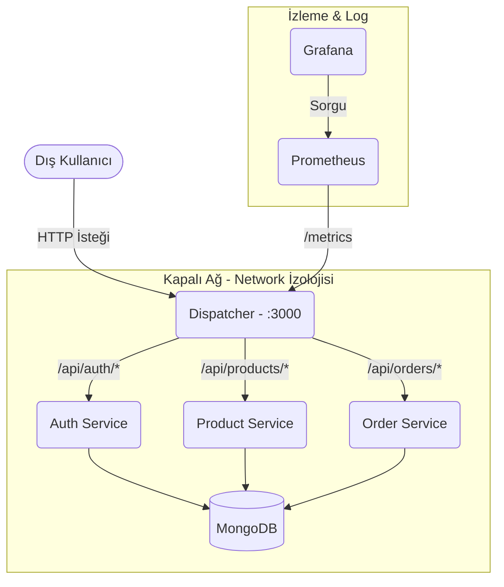
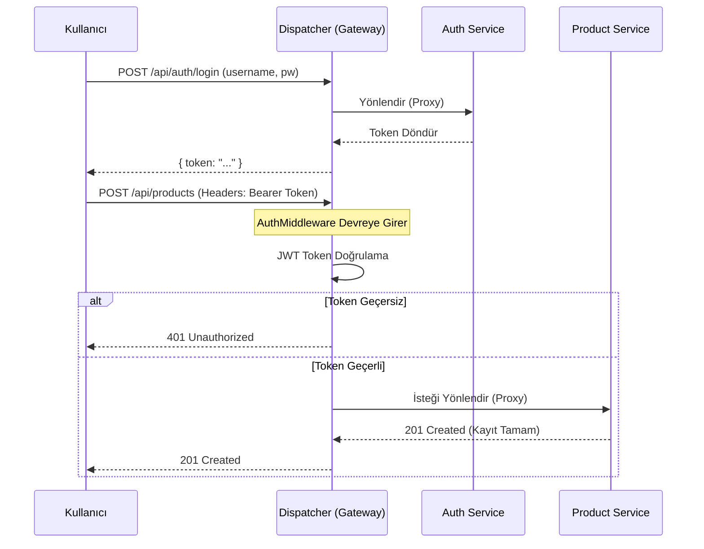

# E-Ticaret Mikroservis Mimarisi API Gateway

Bu proje, bir e-ticaret altyapısını mikroservis mimarisine uygun şekilde yönetmek için geliştirilmiştir. 

## Proje Bileşenleri
- **Dispatcher (API Gateway)**: Sistemin tek giriş noktasıdır. Proxy görevi görerek dışarıdan gelen istekleri yönlendirir. Ayrıca tüm yetkilendirme (JWT) işlemlerini ve Prom-Bundle metrik loglamasını sağlar.
- **Auth Service**: Kullanıcı yetkilendirmesi ve hesap yönetimini (Kayıt, Giriş, Doğrulama) MongoDB veritabanı üzerinden yürütür.
- **Product Service**: Ürün yönetimi CRUD operasyonlarını MongoDB altyapısıyla gerçekleştirir.
- **Order Service**: Sipariş yönetim işlemlerini MongoDB üzerinde saklar. 

## 1. Mimari Şema (Network Isolation & Docker)

Aşağıdaki şemada mikroservislerin sadece kendi aralarında (`docker network`) görüştüklerini ve dış dünyaya doğrudan açık olmadıklarını görebilirsiniz. Sadece Dispatcher "3000" portu üzerinden isteklere cevap vermektedir.

## 2. Sequence Diyagramı (Yetkilendirmeli Ürün Ekleme Süreci)

Dış dünyanın içerideki izole servislere erişirken Dispatcher tarafından JWT ile nasıl doğrulandığını anlatan akış:

## 3. Richardson Maturity Model (RMM) Seviye 2

Geliştirdiğimiz mikroservisler Richardson Maturity Model (RMM) hiyerarşisinin gereksinimlerini sağlamaktadır. Seviye 0 (her işlem için tek URL ve POST) ve Seviye 1 (Resource base) tamamen geride bırakılmış, **Seviye 2 standartları eksiksiz yerine getirilmiştir**:

- **URIs as Resources**: Her kaynak kendi URI adresi ile tanımlıdır (Örn: `/users`, `/products`, `/orders`).
- **HTTP Metotları (Verbs)**: Bir kaynağı çekmek için `GET`, yeni kayıt için `POST`, mülk değişimi için `PUT` ve silmek için uygun `DELETE` metodları kullanılmaktadır. 
- **Durum Kodları (Status Codes)**: Operasyon sonuçlarında sadece `200 OK` dönmek yerine standarda uygun statüler (`201 Created`, `400 Bad Request`, `401 Unauthorized`, `404 Not Found`, `409 Conflict`, `500 Server Error`) kullanılmaktadır.

## 4. Testler (TDD Yaklaşımı)

Test odaklı geliştirme (TDD) yapılarak, her bir servis oluşturulmadan önce uçtan uca testleri (Red durumu) yazılmış, ardından servisler kodlanarak durum `Green`e geçirilmiştir. Test izleme aracı olarak **Jest** kullanılmıştır. İstek yollama işlemleri `supertest` paketi ile mocklanarak yapılmıştır. Her veritabanı CRUD işlemi öncesi veriler (memory seviyesinde) sıfırlanmıştır. 

*Yük Testi*
Projeye eklediğimiz `load-test.js` ile k6 kütüphanesi kullanılarak 50 eşzamanlı aktif kullanıcı simülasyonu çalıştırılıp Gateway'in gücü test edilebilir.

## 5. Kurulum ve Çalıştırma

Sistem `docker-compose up -d --build` komutuyla bütünleşik olarak ayağa kalkar! MongoDB ile birlikte tüm servisler, Prometheus ve Grafana paneli otomatik izole ağda çalışmaya başlar.
